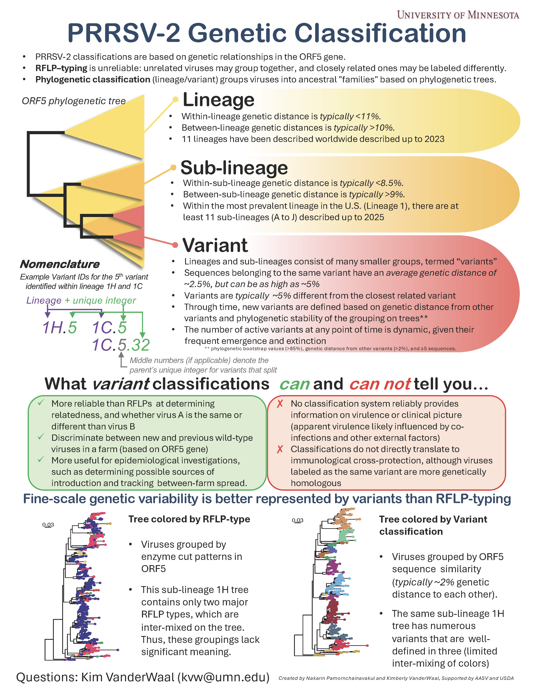

Genetic classification PRRSV-2 sequences in R and Python
================
Kimberly VanderWaal, PhD, & Nakarin Pamornchainavakul, DVM, PhD

## Background

Disease management and epidemiological investigations of Porcine
reproductive and respiratory syndrome virus-type 2 (PRRSV-2) often
relies on grouping together highly related sequences based on the
\***ORF5** gene, which is the most commonly sequenced gene used for
epidemiological monitoring. At present, the method utilized by animal
health practitioners, diagnosticians, and researchers to label closely
related sequences relies on restriction fragment length polymorphisms
(RFLPs) in the ORF5 gene sequence. Unrelated sequences often are grouped
into the same RFLP-type, and closely related sequences sometimes have
different RFLP-types. In contrast, **lineages and sub-lineages** group
virsues into ancestral family groups based on phylogenetic relatedness
(ORF5), but these groups are too large and diverse to meet the
objectives of most on-farm disease monitoring.

Thus, a **fine-scale classification** system is needed to identify and
label closely related sequences that belong to the same **genetic
variant**. In this system, sequences belonging the same variant
typically have an average genetic distance of \~2.5% on the ORF5 gene,
but can be as high as \~5%.

<div class="figure" style="text-align: center">


<p class="caption">
Caption
</p>

</div>

A machine learning algorithm (based on random forest) has been devoloped
to **assign new sequences** to the appropriate variant ID. On this page,
we maintain an **up-to-date** version of the assignment algorithm, which
is updated quarterly. Both **R** and **Python** versions of the
assignment algorithm are maintained. Below is a guide on how to use this
code in R.

A code-free web-tool version of this assignment algorithm is maintained
([here](https://stemma.shinyapps.io/PRRSLoom-variants/))

### Scope

PRRSV-2 variant classifications were developed using national-scale ORF5
sequence datasets from the **U.S., 2015 - present**. During this period,
our national datasets are drawn from \~60% of the U.S. commercial swine
industry, thus we believe that variant classificaitons are broadly
representative of genetic diversity found within the U.S. However, these
classifications should be applied with **extreme caution** to
international datasets or pre-2015 datasets, given that the distinct and
unique genetic diversity existing internationally or prior to 2015 was
not represented in our sequence datasets.

## Assigning sequences in R

This script is used to assign sequences to their appropriate variant ID
using a pre-trained random forest model (“model.Rdata”) and functions
from the”rf.10v.predict.fun.R” available on this page. You should
**not** open or modify any text in the rf.10v.predict.fun.R file.

Here, we use the Github URL to load in the latest vesion of the model.
Loading the model straight from Github, as done here, ensures that the
most up-to-date version of the model is being used.

``` r
#instal required packages
#install.packages("adegenet","caret","randomForest")

#load functions for making the predictions.
source(url("https://github.com/kvanderwaal/prrsv2_classification/raw/main/rf10v.predict.fun.R"))
#load the model
load(url("https://github.com/kvanderwaal/prrsv2_classification/raw/main/model.Rdata"))

#note, if you would like to predict lineages/sub-lineages instead of variants, you can load this model instead.
#lineages/sub-lineages reflect Paploski et al. 2021 (Vaccines: https://dx.doi.org/10.3201/eid2208.160496) and Yim-im et al. 2023 (Microbiology Spectrum: https://dx.doi.org/10.1128/spectrum.02916-23)
#load(url("https://github.com/kvanderwaal/prrsv2_classification/raw/main/model.rf10v.new.lin.11.2023.Rdata"))


#load alignment file (should be in your working directory). 
align.ex <- read.alignment("sequences.example.fasta",format="fasta")  #An example sequence file is available for download from Github, and should be placed in your working directory.  This should be replaced with your own .fasta file

#make the assigments
out <- make.predict(al.new=align.ex)


#write the assigments to a file.  This file will appear in your working directory
write.csv(out,file="out.csv")

#view the assignments
head(out)
#>     strain      assign.top prob.top assign.2 prob.2        assign.3 prob.3
#> ex1    ex1 1A-unclassified    0.844    1A.19  0.078           1A.40  0.014
#> ex2    ex2           1A.14    1.000     <NA>  0.000            <NA>  0.000
#> ex3    ex3 1A-unclassified    1.000     <NA>  0.000            <NA>  0.000
#> ex4    ex4            5A.1    0.994    1H.29  0.002 1H-unclassified  0.002
#> ex5    ex5            1A.5    0.996     1A.6  0.002 1A-unclassified  0.002
#> ex6    ex6            1H.4    0.992     1H.7  0.002            1H.3  0.002
#>        assign.final
#> ex1 1A-unclassified
#> ex2           1A.14
#> ex3 1A-unclassified
#> ex4            5A.1
#> ex5            1A.5
#> ex6            1H.4

#columns:
#assign.top:  the lineage with highest probability
#prob.top:  The probability of the sequence belonging to the top lineage
#assign.2:  the lineage with the second highest probability
#prob.2:  the probability of the sequence belonging to the second most likely lineage
#assign.3:  the lineage with the second highest probability
#prob.3:  the probability of the sequence belonging to the third most likely lineage
#assign.final:  This is the final assignemtn with <.25 called undetermined
```

The output file contains 8 columns. The “assign.final” column is the
assigned variant ID for each sequence.

Col.1 (strain): This is ID of each sequence.  
Col.2 (assign.top): the most probable variant to which the sequence
belongs Col.3 (prob.top): The probability of the sequence belonging to
the most probable (top) variant Col.4 (assign.2): The second-most
probable variable to which the sequence belongs Col.5 (prob.2): The
probability that the sequence belongs to the second-most probable
variant Col.6 (assign.3): The third-most probable variable to which the
sequence belongs Col.7 (prob.3): The probability that the sequence
belongs to the third-most probable variant Col.8 (assign.final): This is
the final assignment, Those with a prob.top of \<.25 are labeled
undetermined

## Assigning sequences in Python
